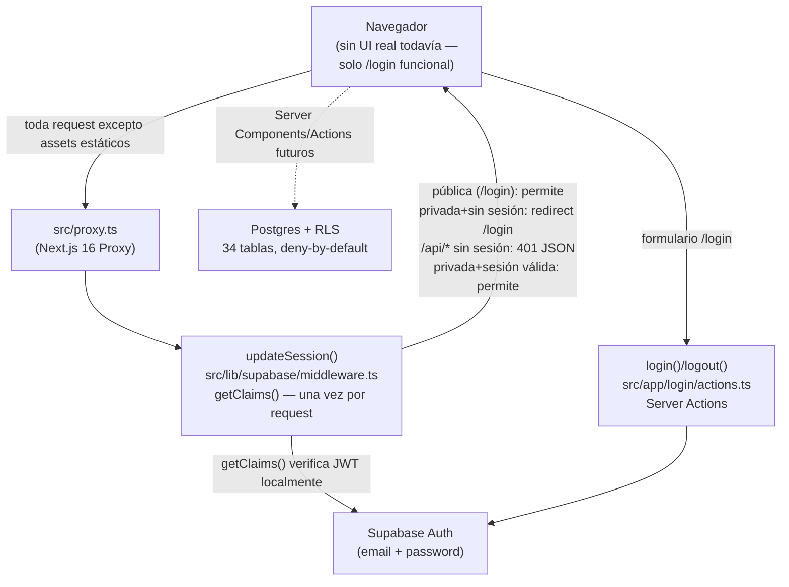
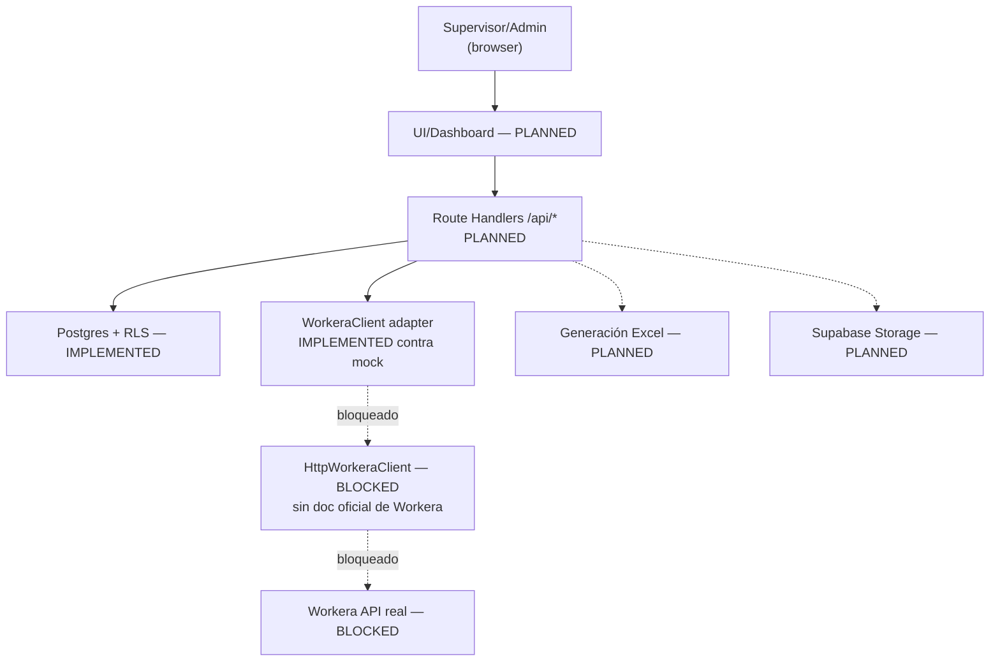

# Arquitectura — Workera Supervisor App

Estado: actualizado tras Gate B pre-UI (rama `fix-pre-ui-session-guard`, HEAD `8aa7db2`). Este documento reemplaza la versión "Fase 1" — describe exactamente lo que existe hoy en el código, distinguiendo `IMPLEMENTED` de `PLANNED`/`BLOCKED`. No se afirma nada como implementado sin verificación directa contra el repositorio en el momento de escribir esto.

## 1. Objetivo

Web app para que supervisores (Producción/Instalación) y RRHH revisen diariamente la asistencia/horas extra de trabajadores (datos que en el futuro vendrán de Workera), aprueben/rechacen decisiones con auditoría completa, y generen un Excel semanal para remuneraciones.

## 2. Estado global por componente

| Componente | Estado |
|---|---|
| Modelo de datos (34 tablas, 24 migraciones) | `IMPLEMENTED` |
| RLS deny-by-default en las 34 tablas | `IMPLEMENTED` |
| Roles (`ADMIN_RRHH`, `SUPERVISOR_PRODUCTION`, `SUPERVISOR_INSTALLATION`) | `IMPLEMENTED` |
| Autenticación (Supabase Auth, email+password) | `IMPLEMENTED` |
| Guard de sesión (Proxy + `getClaims()`) | `IMPLEMENTED` |
| Adapter Workera (interfaz, Zod, mappers, errores) | `IMPLEMENTED` (contra `MockWorkeraClient`) |
| `HttpWorkeraClient` (conexión real a Workera) | `BLOCKED` — sin documentación oficial de Workera (Fase 5/5B/5C) |
| Sincronización real Workera → Supabase | `BLOCKED` (depende de lo anterior) |
| CI (GitHub Actions: `app-quality` + `database`) | `IMPLEMENTED` |
| Route Handlers (`src/app/api/*`) | `PLANNED` — no existe ninguno todavía, solo el README de la carpeta |
| Excel (generación/parsing) | `PLANNED` — no existe ninguna línea de código, solo el README de la carpeta |
| Supabase Storage (documentos de respaldo) | `PLANNED` — la tabla `supporting_documents` tiene una columna `storage_path` que referenciará un bucket futuro; el bucket no existe |
| UI / Dashboard | `PLANNED` — solo existen `/` (placeholder de scaffold) y `/login` |
| Rate limiting propio | `PLANNED` (ver `docs/ABUSE_RATE_LIMITING_PLAN.md`) |
| Backups/recuperación | `PLANNED` (ver `docs/BACKUP_RECOVERY_PLAN.md`) |
| Proyecto Supabase remoto (staging/producción) | `PLANNED` — hoy solo existe el stack local vía Supabase CLI |

## 3. Diagrama de flujo actual (`IMPLEMENTED`)

## 4. Diagrama de flujo futuro (`PLANNED` — no implementado)

**Regla no negociable (vigente desde Fase 1, verificada en el código actual):** el frontend nunca importa `src/lib/workera/*` ni conoce ninguna credencial de Workera. Confirmado: `import "server-only"` en `config.ts`, `client.ts`, `mock-client.ts`, `logging.ts`, `index.ts` de `src/lib/workera/`, verificado además por test automatizado (`security.test.ts`, parte de `test:workera`, 59/59).

## 5. Por qué Route Handlers de Next.js en vez de (o adicional a) Supabase Edge Functions

Decisión heredada de Fase 1, todavía vigente — reincorporada aquí tras revisión de este gate (se había omitido en la reescritura anterior):

- Un solo repo y un solo deploy (Vercel, cuando exista) reduce complejidad operativa mientras el equipo es chico.
- El patrón adaptador (`WorkeraClient`, ya implementado) aísla la lógica de integración: si más adelante conviene mover la sincronización a una Supabase Edge Function (por ejemplo, para correr con cron nativo de Supabase sin depender de Vercel Cron), se mueve el *caller*, no la lógica del cliente Workera — el adapter ya está diseñado para eso.
- Cron (`PLANNED`, no implementado): la idea original era que Vercel Cron Jobs disparara `POST /api/sync/workera` diariamente una vez que exista tanto el Route Handler como `HttpWorkeraClient`. Alternativa no descartada: Supabase Scheduled Functions. Ninguna de las dos está configurada — no hay ningún cron real corriendo hoy.

Esta decisión se revisita cuando se desbloquee la documentación de Workera y se diseñe el primer Route Handler real.

## 6. Autenticación y guard de sesión (`IMPLEMENTED` — Gate B)

- `src/proxy.ts`: Proxy de Next.js 16 (convención de archivo, sin import manual — confirmado por `next build` generando `ƒ Proxy (Middleware)`). `matcher` excluye `_next/static`, `_next/image`, `favicon.ico` y extensiones estáticas comunes.
- `src/lib/supabase/middleware.ts`: `updateSession()` — crea el cliente SSR de Supabase con cookies de request/response, llama `supabase.auth.getClaims()` **exactamente una vez por request** (verificación local del JWT, nunca `getSession()` ni `getUser()` para la decisión de autorización).
- Predicado de identidad verificada: `!error && typeof claims.sub === "string" && claims.sub.length > 0`. Un objeto de claims vacío o sin `sub` se trata como no autenticado.
- Rutas públicas: allowlist exacta `{"/login"}`. Todo lo demás es privado por defecto (secure-by-default).
- Rutas `/api` y `/api/*` (aún sin ningún Route Handler real) responden `401 {"error":"unauthorized"}` en vez de redirigir HTML.
- Fail closed: cualquier excepción inesperada de `getClaims()` (ej. JWKS inalcanzable) se trata como no autenticado, nunca se concede acceso por defecto.
- Cookies: cualquier renovación de sesión se preserva íntegra (incluye `httpOnly`, `secure`, `sameSite`, `path`, `maxAge`) tanto en respuestas permitidas como en redirects y 401 — verificado por test.
- Logging: en fallo inesperado se registra únicamente `{event: "session_guard_error", errorName}` — nunca pathname, query string, cookies, token, claims, ni email.
- Este guard es **defensa en profundidad**. La autoridad real de datos sigue siendo RLS — el guard nunca la reemplaza ni la debilita.
- Cobertura: 26/26 tests (`src/lib/supabase/middleware.test.ts`, ejecutado vía `npm run test:auth`), cero llamadas de red real (cliente Supabase inyectado por fábrica falsa en los tests).

## 7. Roles y autorización (`IMPLEMENTED`)

Enum Postgres `app_role`: `ADMIN_RRHH`, `SUPERVISOR_PRODUCTION`, `SUPERVISOR_INSTALLATION`. `profiles.role` es nullable — un usuario recién creado no tiene ningún rol (sin acceso) hasta que `ADMIN_RRHH` se lo asigna manualmente (bootstrap del primer admin: proceso manual, documentado, no automatizado).

Helpers `SECURITY DEFINER`, `stable`, `search_path = ''`, `EXECUTE` revocado de `anon`/`public`:
- `current_user_role()`, `is_admin_rrhh()`, `is_supervisor_production()`, `is_supervisor_installation()`, `is_corporate_user()`.
- `can_manage_employee(p_employee_id uuid)`: `is_admin_rrhh() OR (supervisor del grupo actual del trabajador)`.

## 8. Modelo de datos (`IMPLEMENTED`)

**24 migraciones**, **34 tablas**, todas con RLS habilitado (verificado: `grep` sobre `supabase/migrations/*.sql` confirma 34 `enable row level security` para 34 `create table`, deny-by-default sin excepción). Grupos funcionales:

- Organización: `profiles`, `employee_groups`, `employees`, `employee_group_assignments`, `supervisor_assignments`.
- Horarios/políticas: `work_schedules`, `work_schedule_rules`, `schedule_assignments`, `overtime_policies`, `late_arrival_policies`, `bonus_policies`, `bonus_types`.
- Asistencia (fuente Workera, versionada, inmutable salvo `is_current`): `attendance_records`, `sync_runs`, `attendance_statuses`, `attendance_status_records`.
- Horas extra/atrasos: `overtime_types`, `overtime_records`, `overtime_decisions`, `late_arrival_records`, `late_arrival_decisions`, `attendance_corrections`.
- Ausencias: `absence_types`, `absence_records`, `absence_decisions`.
- Bono: `employee_daily_bonuses`.
- Revisión/cierre: `daily_reviews`, `weekly_reviews`, `weekly_review_snapshots`, `reporting_periods`, `period_snapshots`.
- Documentos/exportación/auditoría: `supporting_documents`, `excel_exports`, `audit_log`.

Integridad: FK en todas las relaciones, `UNIQUE(source, external_id)` para idempotencia de sync, `EXCLUDE USING gist` anti-solapamiento en tablas de calendario/política, trigger `enforce_immutable_columns()` en hechos/decisiones/auditoría (columna `is_current` como única excepción mutable donde aplica).

## 9. Adapter Workera (`IMPLEMENTED` contra mock; `HttpWorkeraClient` `BLOCKED`)

`src/lib/workera/`: interfaz `WorkeraClient`, `MockWorkeraClient` (datos ficticios, pipeline schema→mapper completo), validación Zod (`schemas/*.ts`, modo `strip` deliberado — no `.strict()` — para tolerar campos nuevos de Workera sin romper), mappers, 8 clases de error tipadas (`errors.ts`), `capabilities.ts` (matriz de capacidades, todo `UNKNOWN` hasta confirmar contra documentación oficial), `logging.ts` (eventos estructurados sin PII/secretos).

`HttpWorkeraClient`: **no existe ningún archivo**. Bloqueado en Fase 5/5B/5C por ausencia de documentación oficial de Workera (mecanismo de autenticación, endpoints, formatos) pese a que las credenciales reales ya están configuradas localmente en `.env.local` (nunca leídas ni mostradas en ningún documento). Ver `docs/WORKERA_PHASE5C_BLOCKED.md`.

Cobertura: 59/59 tests (`npm run test:workera`), incluye `security.test.ts` que verifica automáticamente ausencia de `NEXT_PUBLIC_WORKERA_*` y de valores reales en `.env.example`.

## 10. CI — GitHub Actions (`IMPLEMENTED`, Gate A)

`.github/workflows/ci.yml`: `contents: read` global, `concurrency` con cancelación de runs previos, sin `pull_request_target`, todas las Actions fijadas a SHA verificado contra los repositorios oficiales (no `latest`/`main`/`master`).

- **`app-quality`** (Ubuntu, timeout 15 min): checkout → Node 24.19.0 (cache npm) → `npm ci` → lint → `next typegen` → `tsc --noEmit` → `test:workera` (59/59) → `test:auth` (26/26) → build.
- **`database`** (Ubuntu, timeout 30 min): checkout → confirma Docker → Supabase CLI 2.115.0 pinneado → `supabase start` → `supabase db reset` (24 migraciones desde cero) → `supabase test db` (pgTAP, 119/119) → `supabase stop --no-backup` (`if: always()`, corre incluso si algo falla antes).

Ambos jobs verificados `success` en ejecuciones reales sobre GitHub (no solo localmente) — ver checkpoints de Gate A y Gate B.

## 11. Límites de confianza

| Límite | Estado |
|---|---|
| Navegador ↔ Next.js | `IMPLEMENTED` en dev (HTTP local) — la garantía HTTPS de producción es `PLANNED`, no existe deploy todavía; no asumir HTTPS hasta confirmar el dominio real |
| Next.js Proxy ↔ Supabase Auth | `IMPLEMENTED` — `getClaims()`, verificación local del JWT |
| Next.js ↔ Postgres | `IMPLEMENTED` — siempre vía RLS, cliente `anon`/`authenticated`, nunca `service_role` desde código de request |
| Next.js ↔ Workera | `BLOCKED` — no existe conexión real |
| Next.js ↔ Supabase Storage | `PLANNED` — no existe |
| GitHub Actions ↔ repositorio | `IMPLEMENTED` — `contents: read`, sin secretos, ver `docs/THREAT_MODEL.md` sección supply-chain |
| Backup ↔ datos de producción | `PLANNED` — no existe proyecto de producción todavía |

## 12. Componentes explícitamente no implementados (`PLANNED`)

- Cualquier página de UI más allá de `/login` (placeholder mínimo, sin diseño) y `/` (scaffold de `create-next-app`, sin lógica de negocio).
- Cualquier `route.ts` bajo `src/app/api/` — la carpeta solo tiene un `README.md` con los endpoints previstos, ninguno implementado.
- Generación/parsing de Excel (`src/lib/excel/` solo tiene `README.md`).
- Supabase Storage real (bucket, políticas, signed URLs).
- Rate limiting propio (ver `docs/ABUSE_RATE_LIMITING_PLAN.md`).
- Backups/recuperación (ver `docs/BACKUP_RECOVERY_PLAN.md`).
- Cualquier proyecto Supabase remoto (staging o producción) — hoy todo el desarrollo/CI corre contra el stack local de Supabase CLI.

## 13. Decisiones pendientes

Consolidadas en `docs/DECISIONS_PENDING.md` (creado en este mismo gate) para no duplicar contenido disperso entre documentos.

## 14. Documentos relacionados

- `docs/THREAT_MODEL.md` — modelo de amenazas formal (STRIDE + privacidad/abuso).
- `docs/API_SECURITY_STANDARD.md` — checklist obligatorio para cualquier futura ruta `/api/*`.
- `docs/ABUSE_RATE_LIMITING_PLAN.md` — estrategia de rate limiting (propuesta, no implementada).
- `docs/BACKUP_RECOVERY_PLAN.md` — estrategia de backups/recuperación (propuesta, no implementada).
- `docs/SECURITY_PHASE3.md` — detalle histórico de la matriz de permisos de Fase 3 (sigue vigente para ese contenido).
- `docs/DECISIONS_PENDING.md` — decisiones de negocio/seguridad sin confirmar.
