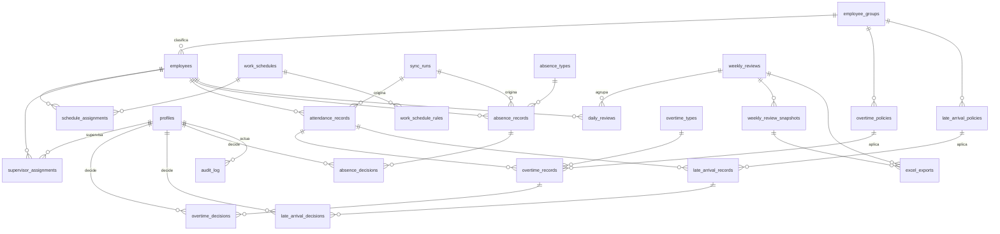

# Modelo de datos — Fase 2

Esquema PostgreSQL inicial, implementado en `supabase/migrations/`. Basado en, y no contradice:
- `docs/PRE_FASE2_WORKERA_VALIDATION.md`
- `docs/EXCEL_WORKFLOW_ANALYSIS.md`
- `docs/BUSINESS_RULES_PRE_PHASE2.md` (v2 — especificación funcional vigente)

**Alcance de esta fase:** solo el esquema (tablas, constraints, índices, triggers, seeds estructurales confirmados) y sus tests de integridad. **No** incluye motor de cálculo, sincronización real con Workera, autenticación/RLS final, UI ni generación de Excel — todo eso es de fases posteriores y se apoya en este esquema sin requerir rediseñarlo.

---

## 1. ERD

*(No incluye `audit_log` con FKs de dominio en el diagrama por ser una tabla transversal sin relaciones tipadas — ver sección 18.)*

---

## 2-3. Entidades y relaciones

Ver migraciones en `supabase/migrations/` (una tabla por concepto, agrupadas en 7 archivos numerados). Resumen por archivo:

| Migración | Contenido |
|---|---|
| `01_core_organization` | `profiles`, `employee_groups`, `employees` |
| `02_schedules_and_policies` | `work_schedules`, `work_schedule_rules`, `schedule_assignments`, `supervisor_assignments`, `overtime_policies`, `late_arrival_policies` |
| `03_attendance_and_sync` | función `enforce_immutable_columns()`, `sync_runs`, `attendance_records` |
| `04_overtime_and_lateness` | `overtime_types`, `overtime_records`, `overtime_decisions` (+ trigger de validación cruzada), `late_arrival_records`, `late_arrival_decisions` (+ trigger) |
| `05_absences` | `absence_types`, `absence_records`, `absence_decisions` |
| `06_reviews_audit_exports` | `daily_reviews`, `weekly_reviews`, `weekly_review_snapshots`, `excel_exports`, `audit_log` |
| `07_seeds` | datos de catálogo/política confirmados (sección 21) |

---

## 4. EmployeeGroup

`employee_groups`: catálogo (no enum de Postgres), porque es una clasificación de negocio que puede crecer sin deploy de código (docs/BUSINESS_RULES_PRE_PHASE2.md sección 1). Es la llave de `overtime_policies`/`late_arrival_policies` — nunca `department`/`cost_center` de Workera directamente. Sembrado con `ADMINISTRATION`/`PRODUCTION` (confirmado).

`employees.employee_group_id` es **nullable**: la sincronización debe poder crear el registro crudo de un trabajador aunque Workera no entregue su grupo de forma confiable todavía (P1 abierta). "Trabajador sin `employee_group`" es una validación `BLOCKING` a nivel de `DailyReview` (fase futura), no un `NOT NULL` aquí — forzarlo rompería la idempotencia del sync.

---

## 5. SupervisorAssignment

`supervisor_assignments`: relación histórica con `effective_from`/`effective_to`, no un campo fijo en `employees`. `supervisor_profile_id` referencia `profiles(id)` (ver sección 17 sobre por qué existe `profiles` ya en Fase 2).

**Constraint `EXCLUDE USING gist`** impide que un mismo `employee_id` tenga dos asignaciones de supervisor con rangos de fecha solapados — un trabajador tiene un único supervisor vigente por fecha. Si el negocio confirma que puede haber más de un supervisor simultáneo (ej. cobertura de vacaciones), esta constraint debe revisarse explícitamente; no se asumió esa flexibilidad sin evidencia.

Responde correctamente "¿quién era supervisor de este trabajador el 10 de agosto?": `select ... where employee_id = ? and daterange(effective_from, effective_to, '[]') @> date '2026-08-10'`.

---

## 6. WorkSchedule

Dos tablas, no una sola ancha (`work_schedules` + `work_schedule_rules`), para poder agregar turnos futuros (ej. nocturno) sin alterar columnas, y para que un día no laboral se represente por ausencia de fila o `scheduled_start`/`scheduled_end` nulos, en vez de una columna `is_day_off` adicional.

`work_schedule_rules` asume jornadas dentro del mismo día calendario (`scheduled_end > scheduled_start`, CHECK) — no contempla turnos que cruzan medianoche, porque no hay un caso real confirmado que lo requiera hoy. Documentado como supuesto a revisar si aparece esa necesidad.

Sembrado (`07_seeds.sql`): "Horario estándar planta" con el horario real conocido (lunes-jueves 07:30-17:00, viernes 07:30-14:50; sábado/domingo sin fila = no laborales).

---

## 7. ScheduleAssignment

`schedule_assignments`: mismo patrón que `supervisor_assignments` (vigencia + `EXCLUDE` anti-solapamiento). Responde "¿qué horario tenía Juan el 10 de agosto?" aunque después haya cambiado de jornada, porque el horario nunca es un campo fijo en `employees`.

---

## 8-9. OvertimePolicy — sin hardcodear el tope de 120

`overtime_policies`: fila por `employee_group_id` + `day_of_week` + vigencia, con `overtime_eligible` y `max_overtime_minutes`. El **único** CHECK universal es `max_overtime_minutes >= 0` — el valor `120` vive exclusivamente en `07_seeds.sql` como dato, nunca en una constraint del esquema. Si la política cambia (o se confirma la regla de viernes), es un `INSERT`/`UPDATE` de datos, no una migración de esquema.

`overtime_policy_id` es **`NOT NULL`** en `overtime_records`: si no existe una política para un grupo/día (ej. `PRODUCTION` + viernes, regla `P0` sin confirmar — deliberadamente no sembrada), el motor de cálculo futuro **no debe crear** un `overtime_record` adivinando un tope; debe abstenerse y dejar el `DailyReview` en `NEEDS_REVIEW`. Esto es una decisión de diseño explícita: la ausencia de fila de política es la señal de "regla no confirmada", no un valor por defecto implícito.

---

## 10. LateArrivalPolicy

`late_arrival_policies`: mismo patrón (grupo + día + vigencia + `EXCLUDE` anti-solapamiento). Sembrado con `tolerance_minutes = 0` para **todos** los grupos y los 7 días (confirmado como valor por defecto documentado hasta que RRHH indique lo contrario — docs/BUSINESS_RULES_PRE_PHASE2.md sección 13).

---

## 11. Attendance versioning

`attendance_records` es la pieza central del versionado de hechos:

- `source_version` (entero, empieza en 1) + `is_current` (booleano).
- `UNIQUE (employee_id, work_date, source_version)`: no se puede repetir un número de versión.
- Índice único parcial `WHERE is_current`: solo una versión "vigente" por trabajador+fecha.
- **Trigger de inmutabilidad** (`enforce_immutable_columns('is_current')`): un `UPDATE` que intente cambiar `actual_clock_in`, `actual_clock_out`, `source_hash`, etc. de una fila ya insertada se rechaza con excepción. Solo `is_current` puede cambiar. Esto es lo que garantiza, a nivel de base de datos y no solo por disciplina de aplicación, que "Workera cambia un dato" nunca sobrescribe el hecho que ya originó una decisión — crea una fila nueva.
- `source_hash` existe siempre (lo calcula nuestro sync); `external_id` es nullable porque no todos los endpoints de Workera garantizan un ID de registro estable (fallback documentado en `PRE_FASE2_WORKERA_VALIDATION.md` sección 8). Cuando existe, `UNIQUE (source, external_id) WHERE external_id IS NOT NULL` da idempotencia real.

`overtime_records`/`late_arrival_records` no tienen su propio "sync version": referencian `attendance_record_id`, una fila específica e inmutable. Como esa fila nunca cambia, la referencia por sí sola ya es la prueba de "qué versión de asistencia originó este cálculo" — no se duplica el dato.

---

## 12. Overtime

`overtime_records` = **candidato calculado**, nunca aprobación:
- `candidate_minutes >= 0` (CHECK universal, sin tope hardcodeado — el tope es responsabilidad de la política aplicada al calcular, no de esta tabla).
- `overtime_type_id` (catálogo `OVERTIME_50`/`OVERTIME_100`, extensible) permite que un mismo día tenga varios registros, uno por tasa — nunca columnas `hh50`/`hh100` fijas.
- Mismo patrón de inmutabilidad + versionado que `attendance_records`, pero con `calculation_version` (incrementado por recálculo interno, no por sync de Workera) en vez de `source_version`.

---

## 13. Late arrivals

`late_arrival_records`: mismo patrón, con `scheduled_start`/`actual_start`/`detected_minutes`. `scheduled_start` se guarda como **snapshot explícito** (no solo una FK a `schedule_assignments`), para que el registro sea autocontenido incluso si el horario del trabajador cambia después.

---

## 14. Absences

`absence_records`: hecho versionado (mismo patrón `source_version`/`is_current`/inmutabilidad) por rango de fechas (`start_date`/`end_date`), no por día individual como asistencia — refleja cómo Workera y el Excel real ya representan licencias/vacaciones (rangos, no filas diarias).

**Deliberadamente sin `EXCLUDE` que impida solapamiento** entre `absence_records` del mismo trabajador (ej. licencia y vacaciones simultáneas): Workera puede entregar datos ambiguos que el sistema debe poder almacenar para que un humano los resuelva vía `absence_decisions`. Bloquearlo a nivel de constraint impediría la propia ingesta de datos crudos contradictorios. La validación "vacaciones + licencia simultánea" es `BLOCKING` a nivel de `DailyReview` (aplicación), no una restricción de esta tabla — documentado explícitamente para que no se intente "arreglar" con una constraint más adelante sin entender por qué se omitió.

---

## 15. DailyReview

`daily_reviews`: **la única tabla de esta fase que es intencionalmente mutable** (no versionada como las de hechos/decisiones) — una fila por `(employee_id, work_date)` (`UNIQUE`), con `status` (enum `daily_review_status`: `IMPORTED → PENDING_REVIEW → REVIEWED → READY_FOR_WEEKLY_CLOSE`, más `NEEDS_REVIEW`/`SYNC_CONFLICT`/`CORRECTED_AFTER_REVIEW` como casos no lineales) que transiciona en el tiempo. El historial de transiciones se registra en `audit_log`, no duplicando el patrón de versionado aquí — se evaluó y se descartó versionar también esta tabla por no aportar trazabilidad adicional sobre lo que ya da `audit_log` (evitar sobreingeniería, pedido explícito del encargo).

---

## 16. WeeklyReview

`weekly_reviews`: `period_start`/`period_end` explícitos, **nunca se asume "semana calendario"** — el ciclo real del Excel sigue siendo `P0` sin confirmar. `EXCLUDE USING gist` sobre `daterange(period_start, period_end)` impide períodos solapados. Alcance: **a nivel de compañía** (un período cubre a todos los trabajadores) — ningún documento de negocio describe cierres separados por supervisor/equipo; se documenta aquí como supuesto, no como hecho confirmado.

Estados (`weekly_review_status` enum): `OPEN → READY_TO_CLOSE → CLOSED → REOPENED`. `closed_by`/`closed_at`/`reopened_by`/`reopened_at`/`reopen_reason` guardan el evento más reciente; el historial completo de cierres/reaperturas sucesivas vive en `audit_log`.

---

## 17. Snapshot

`weekly_review_snapshots`: **uno o más por `weekly_review`** (sin `UNIQUE`), porque un `REOPENED` seguido de un nuevo cierre genera un snapshot adicional, dejando el anterior intacto (así el `ExcelExport` viejo sigue siendo válido como historial).

`payload jsonb` contiene **referencias por ID** (`attendance_record_id`, `overtime_decision_id[]`, `late_arrival_decision_id`, `absence_decision_id[]` vigentes por trabajador, más totales agregados) — no una copia de los valores. Como esas filas referenciadas ya son inmutables (nunca se actualizan tras insertar, salvo `is_current`), listar sus IDs es 100% suficiente para reconstruir "qué produjo este Excel" sin duplicar la base completa. Esta es la alternativa elegida sobre "copiar todo el snapshot como datos planos" — balance auditabilidad/sobreingeniería pedido explícitamente.

`profiles`: placeholder mínimo de identidad (`id`, `display_name`, `role`, `active`) creado en Fase 2 **únicamente** para poder tener FKs reales (`decided_by`, `corrected_by`, `closed_by`, etc.) en vez de columnas `uuid` sueltas sin integridad referencial. Fase 3 **agrega** `profiles.auth_user_id` (FK a `auth.users`) y RLS — no reconstruye esta tabla ni las FKs que ya apuntan a ella, evitando así una migración riesgosa sobre datos ya poblados.

---

## 18. SyncRun / AuditLog

`sync_runs`: creado en `03_attendance_and_sync` (no en la migración de auditoría) porque `attendance_records`/`absence_records` lo referencian. `status` es un enum (`RUNNING`/`SUCCEEDED`/`FAILED`/`PARTIAL`) por ser un estado técnico pequeño y estable. `error_summary jsonb` es un resumen sanitizado — **nunca** payloads completos de Workera ni credenciales (no hay ninguna columna para API keys).

`audit_log`: transversal por diseño. `entity_id` es un `uuid` **sin FK** a propósito — es un log genérico de "qué pasó, quién, cuándo" sobre cualquier entidad, no una tabla de dominio; no debe usarse como sustituto de `overtime_decisions` ni de ninguna tabla específica (por eso no duplica `approved_minutes` ni campos de negocio, solo `metadata jsonb` acotado).

---

## 19. ExcelExport

`excel_exports`: solo metadata en Fase 2 (`weekly_review_id`, `snapshot_id`, `generated_by`, `generated_at`, `template_version`, `validation_status`, `file_hash`, `storage_path`). **No se genera ningún archivo.** `file_hash`/`storage_path` quedan nulos hasta Fase 10. El binario `.xlsx` nunca se guarda como blob en Postgres — `storage_path` apuntará a Supabase Storage cuando exista.

---

## 20. Source of truth (reafirmado, sin cambios respecto a `BUSINESS_RULES_PRE_PHASE2.md` sección 21)

El esquema refleja exactamente esa matriz: `employees`/`attendance_records`/`absence_records` con `source` Workera; `overtime_records`/`late_arrival_records` como cálculo interno (sin campo `source`, sí `overtime_policy_id`/`late_arrival_policy_id`); las tablas `*_decisions` sin ningún campo de sincronización (son 100% internas); `audit_log`/`weekly_review_snapshots`/`excel_exports` como registro propio del sistema.

---

## 21. Idempotencia

- **Con ID externo estable de Workera:** `UNIQUE (source, external_id) WHERE external_id IS NOT NULL` en `attendance_records` y `absence_records` — un segundo intento de importar el mismo registro es rechazado por la base, no solo evitado por lógica de aplicación.
- **Sin ID externo estable (fallback documentado):** la responsabilidad recae en `(employee_id, work_date)` + `source_hash` a nivel de aplicación — el sync (fase futura) debe comparar el hash antes de decidir si crea una nueva versión o no hace nada; el esquema no puede forzar esto genéricamente sin conocer qué endpoints de Workera carecen de ID, por eso queda documentado como responsabilidad de la capa de sincronización, no del esquema.
- **Seeds:** todas las cargas de `07_seeds.sql` son `INSERT` simples (no `UPSERT`) porque corren una sola vez como parte de una migración versionada — si se necesita re-sembrar, es una migración nueva, no una re-ejecución de esta.

---

## 22. Timezone

- Todo instante real: `timestamptz` (`attendance_records.actual_clock_in/out`, todos los `*_at`).
- Todo día laboral/calendario: `date` (`work_date`, `start_date`/`end_date`, `effective_from`/`effective_to`, `period_start`/`period_end`).
- Reglas horarias de jornada: `time` (`work_schedule_rules.scheduled_start/end`, `late_arrival_records.scheduled_start`) — hora de reloj local, interpretada en `America/Santiago` por la aplicación al calcular, nunca por configuración de timezone del servidor de base de datos.
- **No se cambió el timezone global de la base** (queda en UTC, el default de Supabase) — la interpretación de "día laboral" en `America/Santiago` (incluyendo horario de verano variable en Chile) es responsabilidad explícita de la capa de aplicación/cálculo (fase futura), nunca de `now()` del servidor ni del navegador del supervisor. Documentado aquí para que quien implemente el motor de cálculo no asuma lo contrario.

---

## 23. Constraints — resumen de integridad

| Tipo | Ejemplos | Notas |
|---|---|---|
| `PRIMARY KEY` | Todas las tablas, `uuid` con `gen_random_uuid()` | — |
| `FOREIGN KEY` | Todas las relaciones documentadas en el ERD | Sin `ON DELETE CASCADE` salvo `work_schedule_rules → work_schedules` (una regla de horario no tiene sentido sin su jornada) |
| `UNIQUE` | `employees.external_workera_id`, `employee_groups.code`, versiones de hechos, IDs externos | — |
| `UNIQUE` parcial | "solo una fila `is_current`" en cada tabla de hechos/decisiones versionada | Vía `WHERE is_current` |
| `CHECK` (fila) | `minutes >= 0` en todas las cantidades, `effective_to >= effective_from`, `period_end >= period_start`, formato de RUT, coherencia `decision_status` vs. cantidades | Universales — nunca codifican una regla de negocio configurable (ej. no hay `<= 120`) |
| `EXCLUDE USING gist` | Anti-solapamiento en `schedule_assignments`, `supervisor_assignments`, `overtime_policies`, `late_arrival_policies`, `weekly_reviews` | Requiere `btree_gist` para combinar igualdad (uuid) + rango de fechas |
| Trigger | `enforce_immutable_columns()` en 7 tablas; `validate_overtime_decision()`; `validate_late_arrival_decision()` | Para reglas que cruzan tablas (no expresables con `CHECK` de una fila) — documentado explícitamente en cada migración por qué es trigger y no `CHECK` |

---

## 24. Índices

Todos con propósito documentado en el comentario de la migración correspondiente; ninguno "por si acaso". Los más relevantes para consultas futuras reales:

- `employees (employee_group_id)` — filtrar dashboard por Producción/Administración.
- `attendance_records (employee_id, work_date)` + índice único parcial `is_current` — la consulta más frecuente ("asistencia vigente de X en fecha Y").
- `overtime_records`/`late_arrival_records` análogos, más índice sobre `attendance_record_id` (para navegar de un hecho a sus cálculos derivados).
- `supervisor_assignments (supervisor_profile_id)` — "trabajadores de este supervisor", base de la futura RLS.
- `daily_reviews (status)` y `(weekly_review_id)` — "pendientes de revisión" y "revisión de esta semana".
- `audit_log (entity_type, entity_id)` y `(occurred_at)` — historial por entidad y por rango de tiempo.
- `absence_records (employee_id, start_date, end_date)` — solapamiento de rangos por trabajador.

No se indexó `reason`/`metadata`/otros campos de texto libre sin un caso de consulta real que lo justifique.

---

## 25. Enum vs. catálogo — decisión por entidad

| Concepto | Elección | Motivo |
|---|---|---|
| `EmployeeGroup` | Catálogo (`employee_groups`) | Clasificación de negocio, puede crecer sin deploy |
| `OvertimeType` | Catálogo (`overtime_types`) | Idem — nuevas tasas futuras |
| `AbsenceType` | Catálogo (`absence_types`) | Idem — vocabulario aún no 100% confirmado (P2) |
| `daily_review_status` | Enum Postgres | Estado técnico, pequeño, estable, cambiarlo es excepcional |
| `weekly_review_status` | Enum Postgres | Idem |
| `sync_run_status` | Enum Postgres | Idem |
| `overtime_decision_status` | Enum Postgres | Idem |
| `late_arrival_decisions.payroll_effect` | `text` + `CHECK` (no enum) | Pequeño conjunto (`DEDUCT`/`DO_NOT_DEDUCT`/`NEEDS_REVIEW`), pero conceptualmente más cercano a una decisión de negocio que a un estado técnico puro — se prefirió `CHECK` sobre enum para mantener el patrón "decisión = texto + CHECK" consistente entre las tres tablas `*_decisions`, sin mezclar dos mecanismos distintos dentro del mismo grupo de tablas |
| `absence_decisions.decision_status` | `text` + `CHECK` | Mismo razonamiento que el punto anterior |
| `source` (`workera`/`manual`/`internal`) | `text` + `CHECK` | Muy pequeño y estable, pero su tratamiento es idéntico en las 4 tablas que lo usan — un `CHECK` inline es más simple que definir un enum compartido para un valor de 2-3 opciones repetido por conveniencia, no por identidad de dominio |

---

## 26. Seguridad / privacidad

- **Sin RLS todavía** (Fase 3). Las tablas son accesibles vía `service_role` en esta fase — no hay política de acceso por rol/supervisor implementada.
- **Minimización de datos aplicada**: `employees` no tiene email/teléfono/dirección; `absence_records`/`absence_types` no tienen ningún campo de diagnóstico o motivo médico — solo tipo + fechas + origen.
- **`profiles`** (placeholder) no almacena credenciales ni tokens — la autenticación real es responsabilidad de `auth.users` en Fase 3.
- **`sync_runs.error_summary`** documentado explícitamente como "sin payloads completos ni credenciales" — ninguna columna de esta fase almacena API keys.
- **RUT**: único dato personal identificable directo almacenado, con formato normalizado y protegido por `UNIQUE` parcial (evita duplicados accidentales que podrían mezclar remuneraciones de dos personas).

---

## 27. Preguntas abiertas (sin inventar respuestas — remite a `BUSINESS_RULES_PRE_PHASE2.md` sección 22)

Ninguna pregunta P0/P1/P2 documentada previamente se resolvió inventando un valor en el esquema. Se resolvieron **estructuralmente** así:

- Regla de viernes / HH50 vs HH100: `overtime_policies`/`overtime_types` existen como catálogos configurables; **no se sembró** una política de viernes para Producción (ausencia deliberada, no un `0` o `null` que pudiera confundirse con "sin horas extra confirmado").
- Tolerancia de atraso: sembrada en `0` **explícitamente documentada como el valor por defecto conocido hasta confirmación**, no una suposición nueva de esta fase.
- Autoridad de aprobación/descuento: el esquema no fuerza que `decided_by` sea de un rol específico (`profiles.role` admite `admin`/`supervisor`, sin restricción adicional) — la restricción de "quién puede decidir qué" es responsabilidad de RLS en Fase 3, no de esta fase.
- Ciclo real del Excel: `weekly_reviews.period_start/period_end` son fechas libres, no "semana calendario" — la pregunta de negocio no bloqueó el diseño porque el campo ya es genérico.
- Viáticos: **fuera de alcance**, sin ninguna tabla ni columna reservada — se agregaría de forma aditiva si se confirma en el futuro (docs/BUSINESS_RULES_PRE_PHASE2.md sección 26).

---

## 28. Fuera de alcance de esta fase

- Motor de cálculo real de horas extra/atrasos (los tests de `007_business_scenarios.sql` insertan valores ya calculados a mano, como haría ese motor, solo para validar que el esquema los acepta correctamente).
- Sincronización real con Workera (`WorkeraClient` sigue siendo el mock de `src/lib/workera/`, sin tocar en esta fase).
- Autenticación (`auth.users`) y RLS.
- Cualquier UI o dashboard.
- Generación real de archivos Excel.
- Cron / disparo automático de sincronización.
- Conversión del `.xls` real a `.xlsx` (sigue sin tocarse, y no se copió a este repositorio).

---

## Anexo — supuestos de diseño explícitos (para revisión humana)

Estos son juicios de ingeniería tomados dentro del espacio que las preguntas de negocio dejaban abierto, no respuestas a las preguntas P0/P1/P2:

1. `WeeklyReview` tiene alcance de compañía completa, no por supervisor/equipo.
2. Un trabajador tiene un único supervisor vigente por fecha (`EXCLUDE` en `supervisor_assignments`) — revisar si el negocio confirma necesidad de supervisión compartida.
3. Las jornadas no cruzan medianoche (sin caso de turno nocturno confirmado).
4. `profiles` como placeholder de identidad se crea en Fase 2 (no se esperó a Fase 3) para evitar FKs sin integridad referencial sobre quién decide/corrige/cierra.
