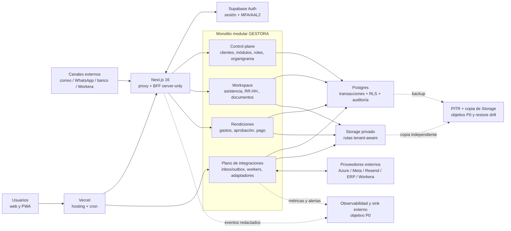
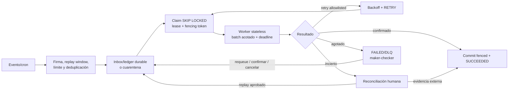
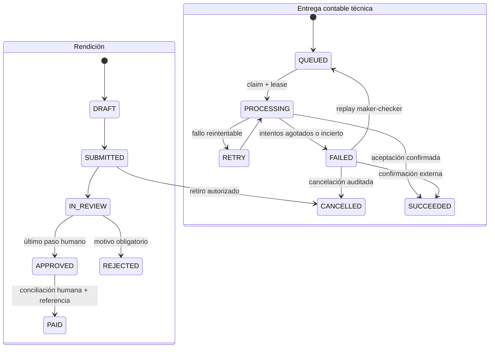

# Arquitectura total de GESTORA — plataforma multiempresa

Estado al 5 de septiembre de 2026. Base auditada: rama
`codex/phases2-6-autonomous`, incluido el cierre local de cuotas de mutación.
Este documento consolida la
arquitectura vigente y objetivo de **todo el producto**: control plane,
workspaces, asistencia, Rendiciones, documentos, integraciones, datos,
seguridad, operación e IA. El nombre del archivo se conserva para no romper los
runbooks y handoffs que ya lo enlazan. No implica que `master`, staging o
producción contengan estos cambios.

Orden de autoridad documental:

1. La sección **Pinned** de `README.md` define las reglas que ningún agente debe
   revertir.
2. Este documento define la arquitectura total, los flujos y los gates de
   evolución; `docs/PLATFORM_MULTI_COMPANY.md` detalla el límite multiempresa.
3. Los documentos de dominio y runbooks definen procedimientos concretos.
4. `ARCHITECTURE.md` es histórico y no representa el estado actual.

Leyenda usada en este documento: **implementado** significa presente y validado
en el repositorio; **apagado** significa implementado detrás de un flag sin
prueba de proveedor real; **objetivo** significa diseño aún pendiente; **gate**
significa condición obligatoria antes de usar PII hospedada o producción.

## 1. Dictamen del comité

### Arquitecto de software y sistemas distribuidos

GESTORA debe continuar como un **monolito modular desplegable** sobre Next.js,
Supabase Auth, Postgres y Storage. Separar hoy cada módulo en microservicios
añadiría latencia, coordinación distribuida, observabilidad y costo operativo
sin una carga que lo justifique.

La arquitectura debe **prepararse para una extracción**, pero esa capacidad aún
no está demostrada: cada integración externa vive detrás de un adaptador
server-only y los trabajos asíncronos usan inbox/outbox durable, idempotencia,
leases y fencing, pero todavía existen lecturas directas del shared kernel y no
hay tests automáticos de límites de módulo. El primer componente que eventualmente
conviene extraer no es una pantalla de negocio, sino el plano de integraciones y
workers cuando su volumen o disponibilidad difieran del tráfico web.

### CISO / DevSecOps

La frontera de seguridad correcta es defensa en profundidad: sesión verificada,
autorización server-side, RLS deny-by-default, funciones privilegiadas con
`search_path = ''`, mínimo privilegio, secretos solo en servidor, archivos
privados y auditoría. Las revisiones Bugbot/Security de cada bloque quedaron
limpias después de corregir sus hallazgos **dentro de ese alcance de código**;
no sustituyen un modelo de amenazas vigente, un pentest ni evidencia operacional.

El sistema **no está aprobado para staging con PII ni para producción**. El
staging existente contiene 97 registros de empleados cuya anonimización no está
demostrada. El código MFA/AAL2 ya está integrado y probado localmente, pero aún
faltan inscripción y activación hospedadas, controles de abuso, prueba real de
backup y restauración DB+Storage, antimalware, reducción del blast radius de `service_role`,
aislamiento laboral para una segunda empresa, observabilidad, incident response,
revisión legal y canarios. Estos son bloqueos, no mejoras opcionales.

### Arquitecto de innovación y plataformas AI

Las decisiones financieras y laborales deben seguir siendo deterministas. La IA
puede explicar, clasificar o proponer un borrador, pero no aprobar, pagar,
conciliar, contabilizar ni cambiar una marcación. La Fase 6 aplica este principio:
preguntas allowlisted, cálculo SQL reproducible, datos minimizados, citas y cero
herramientas de escritura.

Para este repositorio brownfield, regulado y con RLS compleja, el agente principal
debe trabajar directamente sobre Git con tests y revisión humana. Generadores de
aplicaciones son útiles para prototipos aislados de UX, no como autoridad sobre
migraciones, permisos, nómina o contabilidad.

## 2. Estado entregado de las Fases 2–6

### Fase 2 — captura segura de comprobantes

- Captura web y desde cámara/fototeca mediante una interfaz responsive.
- Bandeja durable por empresa y persona, con estado visible para RR. HH./Finanzas.
- Ingesta por correo y WhatsApp detrás de flags deshabilitados por defecto.
- Firma de webhooks, límites de cuerpo/archivo, MIME más firma binaria, Storage
  privado, cuotas, idempotencia, leases y tokens de fencing.
- El número de WhatsApp se representa mediante HMAC; no se persiste el número
  real. La vinculación es de un solo uso, revocable y con vencimiento.

### Fase 3 — conciliación bancaria

- Importación tenant-aware y contratos estrictos para movimientos bancarios.
- Matching determinista, sin permitir que una coincidencia sugerida se convierta
  automáticamente en pago.
- Separación entre sugerencia, decisión humana y registro final.
- Datos bancarios restringidos al permiso `expenses.reconcile` o gestión.

### Fase 4 — salida contable durable

- Outbox transaccional con snapshot mínimo, hash e idempotency key.
- Reclamo concurrente mediante `FOR UPDATE SKIP LOCKED`.
- Reintentos acotados por allowlist (`RATE_LIMIT`), leases recuperables y
  estados explícitos; timeout/red/códigos nuevos quedan en reconciliación humana.
- Run ledger con exclusión de scheduler, fencing, catch-up acotado y watchdog.
- DLQ visible con replay maker-checker, confirmación externa o cancelación
  auditada; nunca se interpreta un timeout como éxito o fracaso financiero.
- Adaptador de proveedor deshabilitado hasta configurar un ERP real; la IA no
  decide cuentas, impuestos ni centros de costo.

### Fase 5 — experiencia móvil sin aplicación nativa

- PWA instalable desde Safari/Chrome, con manifest y orientación al usuario.
- Service worker privacy-safe: solo cachea assets públicos e inmutables.
- Nunca guarda HTML autenticado, APIs, comprobantes, documentos, exportaciones
  ni PII. Navegaciones siempre priorizan red y usan una pantalla offline pública.
- Fallos de Cache Storage no bloquean una respuesta válida de red.

### Fase 6 — asistente operacional reproducible

- Tres preguntas predefinidas: trabajo pendiente, gasto aprobado/pagado y estado
  de pago/contabilidad; ventanas de 7, 30 y 90 días.
- Respuesta determinista en Postgres, esquema Zod estricto, hasta 12 referencias
  y hash SHA-256. No existe prompt ni conversación libre.
- `PAYMENT_STATUS` exige conciliación/gestión; alertas y gasto exigen lectura,
  aprobación o gestión. Los permisos se aplican en UI, aplicación, RPC y RLS.
- El conciliador puro ve referencias, no enlaces 404 a detalles que no puede leer.
- Cuota de 30 consultas por persona/empresa/hora y purga global diaria a los 90
  días, autenticada dos veces y ejecutada por un límite service-role server-only.
- El hash detecta cambios accidentales del registro; no es firma, procedencia ni
  evidencia inmutable. Las 12 referencias son una muestra operativa, no un
  manifiesto de auditoría exhaustivo. Antes de usar la respuesta como evidencia
  financiera se requiere versionar cálculo, instante, zona horaria, redondeo y
  paginar el manifiesto completo.

## 3. Arquitectura lógica vigente

GESTORA opera en dos planos:

1. **Plano de control de plataforma.** Administra empresas, módulos, estados del
   workspace, invitaciones y membresías. Nunca debe ejecutar reglas laborales o
   financieras de un tenant implícito.
2. **Plano de workspace.** Resuelve una empresa activa y aplica sus permisos a
   asistencia, nómina, licencias, documentos, colaciones y Rendiciones.

### Vista total de contenedores

La figura muestra dependencias concentradas, no una topología active-active.
Postgres sigue siendo la autoridad transaccional y el monolito es una sola
unidad desplegable; los workers ya poseen fronteras asíncronas que permiten una
extracción posterior sin convertir cada pantalla en un servicio.

El recorrido sincrónico es:

`Navegador/PWA → Next.js Proxy → Supabase Auth → Server Component/Action/Route → Postgres con RLS y/o Storage privado`.

Los recorridos asíncronos implementados en código son:

- `Resend/Meta → webhook firmado → ledger de captura → descarga validada → Storage → bandeja`.
- `Workera → adaptador server-only → sync_runs/eventos versionados → motor de reglas → revisión humana`.
- `Vercel Cron → ruta con CRON_SECRET → worker OCR/retención/contabilidad/watchdog`.
- `Pago aprobado → outbox contable → adaptador ERP → aceptación o reintento`.

El worker y su watchdog están programados diariamente en `vercel.json`, cadencia
compatible con Hobby. El heartbeat se calcula solo con ejecuciones `CRON` y usa
una ventana de 26 horas; ejecuciones manuales no pueden ocultar un scheduler
detenido. Cada salida tiene timeout, señal de cancelación y reserva de cierre, y
la DLQ fallida se pagina por separado. El run ledger, catch-up y resolución
terminal están implementados y probados localmente. Antes de un piloto deben
activarse en el ambiente, elegir una cadencia coherente con el SLO, conectar
alertas externas y probar el runbook contra el ERP; dos cron del mismo proveedor
no constituyen un watchdog independiente.
La pausa por empresa y su ciclo de vida se aplican en el claim de PostgreSQL. El
watchdog sigue leyendo salud con el kill-switch global apagado y la UI separa un
backlog retenido intencionalmente de una recuperación técnica.

### Límites de módulo y shared kernel

- Control plane es dueño de `companies`, catálogo de módulos, invitaciones y
  membresías; ningún módulo operativo escribe esas tablas directamente.
- Identidad/organización (`profiles`, roles, unidades) es shared kernel. Los
  módulos pueden referenciar IDs y leer contratos explícitos, no copiar ni
  reinterpretar la autorización.
- Asistencia/Workera es dueño de empleados, eventos y registros derivados;
  Rendiciones es dueño de `expense_*` y solo referencia identidad/empresa.
- Una escritura entre dominios debe cruzar un RPC/use case declarado. Las
  lecturas agregadas entre dominios deben migrar a read models o vistas
  versionadas antes de extraer un servicio.
- El gate de límites de módulo impide dependencias nuevas no autorizadas entre
  plataforma, laboral, Rendiciones e integraciones. Los inventarios ejecutables
  cubren HTTP, Server Actions, 88 RPC y 13 operaciones Storage. La extracción
  física sigue siendo un objetivo condicionado por carga y ownership, no una
  garantía del despliegue actual.

### Mapa de dominios y propiedad

| Dominio | Es dueño de | Puede consumir | No puede hacer |
|---|---|---|---|
| Plataforma e IAM | empresas, membresías globales, catálogo de módulos, invitaciones, roles base | identidad de Supabase y auditoría | conceder acceso implícito al workspace |
| Organización | membresías por empresa, unidades y organigrama | empresa e identidad | reutilizar `employee_groups` como jerarquía |
| Laboral y asistencia | empleados, horarios, marcaciones, novedades, períodos, reglas y decisiones | identidad/organización mediante contratos | habilitar una segunda empresa antes de MT-3B–D |
| Rendiciones | `expense_*`, políticas, aprobaciones, conciliación, pago y outbox contable | empresa, persona y permisos | aprobar, pagar o contabilizar automáticamente |
| Documentos y archivos | metadata, rutas privadas, versiones y retención | empresa, actor y caso de negocio | servir un archivo no escaneado o una ruta ajena |
| Integraciones | inbox/outbox, leases, fencing, adaptadores y salud de proveedor | contratos versionados de cada dominio | escribir tablas ajenas saltándose un use case/RPC |
| Auditoría y operación | eventos mínimos, correlation IDs, métricas, alertas y evidencia | señales redactadas de todos los dominios | guardar secretos, payloads completos o convertirse en fuente financiera |

La variación entre clientes se implementa con **módulos, entitlements,
configuración versionada, roles/permisos y workflows por empresa**. No se crean
forks, tablas clonadas ni condicionales por nombre de cliente. Una función
especial que se vuelve común se promueve al catálogo; una excepción temporal
lleva fecha de expiración, owner y test.

### Experiencia multiempresa y dashboards

- El **dashboard GESTORA** es la consola profesional del proveedor: cartera de
  clientes, estado de onboarding, módulos contratados/activados, responsables,
  salud de integraciones, riesgos/SLA y acciones administrativas auditadas.
- El **dashboard de empresa** muestra únicamente el tenant activo: organigrama,
  personas, pendientes, políticas, aprobaciones y KPIs de sus módulos. Cambiar de
  empresa obliga a resolver nuevamente membresía, módulo y permisos.
- Supervisores, Finanzas, RR. HH. y personas reciben vistas derivadas de
  capacidades; no se codifican dashboards distintos por nombre de cliente.
- Los KPIs cruzados del control plane provienen de read models agregados y
  minimizados. El rol de plataforma no obtiene por ello documentos, datos
  bancarios, médicos o laborales detallados.
- Configuración se resuelve en capas explícitas: default versionado del módulo →
  política de empresa → permisos del rol → alcance organizacional del actor. Cada
  resultado crítico guarda la versión efectiva para que un cambio futuro no
  reescriba una decisión pasada.
- Nuevos módulos deben poder activarse en `PILOT`, pausarse y retirarse por
  empresa, con migración/retención de datos y rollback definidos; un toggle de UI
  no es el gate de seguridad.

## 4. Reglas y control de flujo obligatorios

### Tenant explícito

- Toda tabla operativa nueva lleva `company_id` no nulo.
- Toda relación sensible debe impedir cruces de empresa mediante FK o validación
  equivalente; no basta con filtrar en la interfaz.
- Todo job, RPC, importación, exportación, objeto de Storage e idempotency key
  incluye la empresa explícitamente.
- Cada superficie nueva incorpora pruebas negativas de cruce tenant en pgTAP y
  en la capa de aplicación.

### Consistencia y concurrencia

- Escrituras críticas se realizan en RPC transaccionales cuando varias tablas
  deben cambiar juntas.
- Eventos entrantes usan inbox/ledger durable; salidas externas usan outbox.
- Reintentar el mismo evento debe ser duplicate-safe dentro de la aplicación.
- Leases recuperables se combinan con fencing token para que un worker vencido
  no cierre trabajo reclamado por otro.
- Estados de negocio y estados técnicos se separan; `FAILED` de un proveedor no
  revierte silenciosamente una decisión humana.
- El contrato extremo a extremo es **at-least-once**: puede haber reintentos y un
  proveedor puede agotar su ventana o aceptar una operación antes de que falle la
  respuesta. Se requiere DLQ, replay y reconciliación; no se promete exactly-once
  ni ausencia absoluta de pérdida fuera de los supuestos documentados.

### Contratos

- Zod valida entradas externas y respuestas privilegiadas.
- Los adaptadores no exponen DTO del proveedor al dominio.
- Los errores enviados al cliente son códigos allowlisted; mensajes, payloads,
  secretos y stack traces nunca cruzan la frontera.
- Versionar contratos de eventos y snapshots antes de incorporar un segundo
  consumidor.

### Flujo sincrónico de toda operación

Cada lectura o cambio pasa por el mismo pipeline. La UI solo presenta
capacidades; nunca decide autorización.

```mermaid
flowchart LR
    R["Request + correlation_id"] --> S["1. Verificar sesión"]
    S --> T["2. Resolver company_id explícito"]
    T --> M["3. Validar ciclo de vida + módulo"]
    M --> P["4. Validar permiso/capacidad"]
    P --> A["5. Exigir AAL2 si es privilegiada"]
    A --> V["6. Validar esquema, tamaño y estado"]
    V --> I["7. Idempotencia/precondición"]
    I --> X["8. Transacción/RPC + auditoría + outbox"]
    X --> O["9. DTO mínimo o error allowlisted"]
```

- Si sesión, empresa, módulo, permiso o AAL son ambiguos/`NULL`, la operación
  falla cerrada.
- El `company_id` se obtiene de un selector autorizado o del recurso validado;
  jamás de una constante global ni de la primera empresa encontrada.
- Una escritura crítica usa clave de idempotencia o versión esperada, comprueba
  transición de estado y persiste auditoría en la misma transacción.
- Una lectura no crea outbox, pero sí conserva límites, autorización y
  minimización. Exportar o descargar es una acción auditable y rate-limited.
- Errores externos se traducen a códigos estables; el detalle queda redactado en
  telemetría y no llega al navegador.

### Flujo asíncrono y control de presión

- Los productores reciben rápido después de persistir el evento; no esperan una
  cadena de proveedores para confirmar recepción.
- Cada cola define cupo global y por empresa, tamaño de batch, timeout, máximo de
  intentos, backoff con jitter, antigüedad máxima y política de DLQ.
- La equidad es por tenant: un cliente con backlog no debe agotar todos los
  workers, conexiones ni cuota de proveedor.
- El sistema aplica backpressure antes de saturar Postgres o un tercero: rechaza
  con código reintentable o deja trabajo durable; nunca abre concurrencia sin
  límite.
- Un timeout externo es **estado desconocido**, no fracaso definitivo. La misma
  idempotency key se conserva hasta reconciliarlo.
- Vercel puede solapar o duplicar invocaciones cron y no reintenta una invocación
  fallida; por eso los locks, la idempotencia, el run ledger y un watchdog externo
  son requisitos de diseño, no optimizaciones.

### Máquinas de estado que no se mezclan

`PAID` es una decisión de negocio con referencia; `SUCCEEDED` es la confirmación
técnica de una salida contable. Un error o replay del segundo flujo jamás reabre
ni modifica silenciosamente el primero. Asistencia aplica la misma separación:
el evento bruto, el registro derivado, el candidato de regla y la decisión humana
son hechos distintos y versionados.

### Sobre de eventos y comandos

Antes de que exista un segundo consumidor, todo evento interoperable debe incluir
como mínimo: `event_id`, `event_type`, `schema_version`, `company_id`,
`aggregate_type`, `aggregate_id`, `aggregate_version`, `occurred_at`,
`correlation_id`, `causation_id`, `idempotency_key` y un payload minimizado. Los
identificadores de persona o documentos solo aparecen si el consumidor los
necesita y está autorizado. Cambios incompatibles crean una nueva versión; no se
reescribe historia ya publicada.

## 5. Escalabilidad y alta disponibilidad

### Etapa actual: marcha blanca y primeras empresas

- Mantener un despliegue web y una base Postgres administrada.
- Escalar horizontalmente Next.js; no guardar sesión ni locks en memoria del
  proceso web.
- Postgres es la autoridad; RLS e índices deben resolver las consultas dentro del
  presupuesto antes de añadir caché.
- Ejecutar workers como invocaciones stateless sobre colas durables en tablas.

### Al crecer el volumen

Activar cambios únicamente por métricas:

- Separar workers del tráfico web cuando consuman CPU/tiempo o necesiten una
  disponibilidad distinta.
- Particionar tablas de eventos/auditoría por tiempo y, solo si el volumen lo
  exige, por tenant de alto tráfico.
- Incorporar pool de conexiones, réplica de lectura y caché de agregados sin PII
  para dashboards. Ninguna caché reemplaza RLS ni es autoridad financiera.
- Extraer el plano de integraciones como servicio independiente cuando existan
  varios proveedores o backlog sostenido; conservar el outbox como frontera.

### Umbrales para evolucionar, no para adivinar

Los siguientes son tripwires iniciales que el owner técnico debe ratificar con
dos semanas de telemetría; no son promesas de capacidad del proveedor.

| Señal repetida después de optimizar | Cambio habilitado | Cambio que todavía no corresponde |
|---|---|---|
| Workers consumen >30 % de conexiones/CPU o hacen incumplir el p95 interactivo | runtime y pool de workers separados, misma cola/outbox | dividir todos los módulos en microservicios |
| Antigüedad de cola supera su SLO o un proveedor exige otra cadencia/SLA | scheduler/queue dedicado, autoscaling acotado y cuota por tenant | aumentar concurrencia sin backpressure |
| Lecturas agregadas mantienen CPU primaria >70 % o p95 fuera de presupuesto | índices, read model; luego réplica/caché con invalidación explícita | cachear decisiones o saltar RLS |
| Tabla append-only alcanza decenas de millones de filas y mantenimiento/planes lo justifican | partición temporal y política de retención probada | particionar cada tabla desde el inicio |
| Un tenant usa >25 % de recursos o exige residencia/aislamiento contractual | pool, cuota o data plane dedicado detrás del mismo contrato | fork de aplicación por cliente |
| El RTO/RPO contratado no cubre la pérdida de una región | diseño de failover probado y runbook de cutover | declarar active-active sin reconciliación de datos |

La extracción inicial recomendada es **Integration Worker**, manteniendo en el
monolito la autorización y la decisión de negocio. La segunda candidata es
Reporting/read models. Control plane, permisos, asistencia y Rendiciones no se
separan hasta que ownership de datos, contratos, trazas y capacidad operativa
estén demostrados.

### Reducir el impacto de dependencias únicas

Vercel, Supabase, el proveedor de correo, Meta, Workera y el ERP siguen siendo
dependencias externas. La aplicación reduce su impacto con degradación explícita:

- Captura web permanece disponible si WhatsApp/correo falla.
- Los reintentos reducen el riesgo de pérdida y el ledger deduplica los eventos
  recibidos; replay y reconciliación cubren reintentos agotados o caídas prolongadas.
- Un ERP caído acumula outbox sin perder decisiones ni marcar éxito falso.
- El asistente no depende de un LLM externo.
- Las operaciones críticas deben tener backup/PITR y restauración probada; alta
  disponibilidad sin recuperación de datos no es resiliencia suficiente.

La etapa actual **no elimina todos los puntos únicos de fallo**: la base primaria
de Supabase, su plano de control y el hosting administrado siguen siendo
dependencias concentradas; tampoco existe un despliegue active-active multi-región.
Antes del piloto se requiere un watchdog independiente para detectar cron/jobs no
ejecutados; el replay manual ya está probado localmente, pero falta su canario en
el ambiente objetivo. Una topología multi-región o un failover
autogestionado solo se justifica si el impacto, SLO y telemetría reales superan el
costo y la complejidad operacional.

El objetivo de 99,9 % solo puede aprobarse después de verificar SLA/HA y límites
del plan contratado, definir pérdida regional y cutover, medir disponibilidad y
asignar error budget al SPOF aceptado. En el estado actual es una aspiración, no
una propiedad del diseño ni un compromiso de proveedor.

### Continuidad y recuperación

- Definir RPO/RTO por clase: identidad/decisiones, eventos reconstruibles,
  comprobantes/documentos y telemetría no tienen el mismo impacto.
- PITR cubre Postgres, no los objetos de Supabase Storage. Se requiere copia
  cifrada independiente de objetos, manifiesto con checksum y restauración
  conjunta para no recuperar metadata que apunte a archivos inexistentes.
- Un restore drill aislado debe reconfigurar Auth, claves, Realtime, buckets,
  jobs y proveedores, ejecutar conteos/checksums y demostrar cutover y rollback.
- Frecuencia mínima propuesta: prueba trimestral y después de cambios relevantes
  de esquema/Storage; conservar evidencia de RPO/RTO real y corregir desvíos.
- Backups del mismo proveedor reducen pérdida accidental, pero no sustituyen una
  exportación/copia independiente para escenarios de cuenta, control plane o
  borrado del proyecto.

## 6. SLO y observabilidad propuestos

Los siguientes objetivos son una propuesta para aprobar antes de producción:

- Disponibilidad mensual de la interfaz autenticada: 99,9 %.
- Latencia p95 de lectura interactiva: menos de 1,5 s; escritura: menos de 2,5 s,
  excluyendo carga de archivos y proveedores externos.
- Éxito de jobs internos: 99,5 % por día. Los objetivos de backlog de 15 min para
  OCR/captura y 30 min para contabilidad solo entran en vigor después de
  provisionar y medir una cadencia compatible; hoy ambos workers están
  programados una vez al día, por lo que esos objetivos aún no aplican.
- Frescura de asistencia: objetivo acordado con RR. HH.; no declarar “al día” si
  no existe una corrida Workera exitosa para el período mostrado.
- Cero cruces tenant, cero escrituras dobles por reintento y cero decisiones
  automáticas son invariantes de seguridad que deben disparar incidente; no son
  un promedio que pueda consumirse dentro de un SLO.

Instrumentación mínima:

- Correlation ID por request, webhook, sync y job.
- Métricas de latencia/error/saturación, profundidad y antigüedad de cola,
  reintentos, leases recuperadas, cuota rechazada y estado por proveedor.
- Logs estructurados y redactados; nunca token, cookies, payload bancario,
  comprobante, RUT, correo ni error externo crudo.
- Alertas por SLO, job sin ejecución, backlog creciente, error sostenido del
  proveedor, restauración fallida y anomalía de autorización, con dueño, on-call,
  umbral, canal y prueba periódica de paging definidos.
- Trazas distribuidas antes de extraer servicios, para conservar causalidad entre
  webhook, ledger, Storage y resultado.

### Fitness functions de arquitectura

La arquitectura deja de ser una opinión cuando CI impide regresiones. Estas son
las pruebas obligatorias y su estado actual:

| Característica protegida | Fitness function | Estado |
|---|---|---|
| Build reproducible | lockfile + `npm ci`, lint, typecheck, tests y build | implementado en CI |
| Base reproducible | aplicar migraciones desde cero y ejecutar pgTAP en entorno aislado | implementado en CI |
| Secuencia de migraciones | timestamp posterior y test pgTAP correlativo | regla manual; automatizar P0 |
| Aislamiento tenant | toda tabla operativa con `company_id`, RLS/grants y allow/deny cross-tenant | parcial por dominio; gate P0 laboral |
| Mínimo privilegio elevado | cada `createAdminClient` usa capacidad literal inventariada y testada | implementado; grants cloud pendientes |
| Límites de módulo | grafo de imports impide escritura/dependencia prohibida entre dominios | pendiente P0 |
| API segura | matriz authn/authz, tamaño, firma, replay, idempotencia, error y rate limit por ruta | estándar implementado; cobertura continua pendiente |
| Integridad asíncrona | duplicate delivery, lease vencida, fencing, timeout incierto, DLQ y replay | implementado en Rendiciones; extender por integración |
| Privacidad PWA | test impide cachear HTML autenticado, API, PII o documentos | implementado |
| Secretos y supply chain | secret scan, SAST, SBOM/licencias, audit y acciones fijadas por digest | parcial; completar P0 |
| Rendimiento | presupuesto p95, plan de consultas crítico y carga multi-tenant | pendiente P0/soak |
| Recuperación | restore drill DB+Storage cumple RPO/RTO y checksum | pendiente P0 |

Cada ADR nuevo debe nombrar la característica afectada y la fitness function que
evita su regresión. Una excepción requiere owner, motivo, fecha de expiración y
ticket; no se acepta un comentario permanente como control.

## 7. Arquitectura de seguridad objetivo

### Identidad y acceso

- TOTP nativo de Supabase y AAL2 para cuentas privilegiadas. La implementación
  está integrada en esta rama y validada contra una pila Supabase local aislada;
  no está activada ni desplegada. El rollout sigue obligatoriamente el runbook
  de dos pasos para no bloquear cuentas antes de que inscriban sus factores.
- AAL2 debe imponerse en RLS restrictiva, RPC, Route Handlers, Server Actions y
  SSR, no solo por redirección UI. El test debe cubrir JWT/sesión obsoleta,
  unenrollment, reseteo, revocación y degradación de `aal2` a `aal1`.
- Cuenta owner protegida con dos factores TOTP distintos, recuperación break-glass
  ensayada y auditoría; no asumir códigos de respaldo que Supabase no ofrece.
  Administradores RR. HH. no pueden resetear MFA privilegiado.
- MFA también protege GitHub, Supabase, Vercel, DNS, correo y gestor de secretos;
  la cuenta de aplicación no es la única identidad de alto impacto.
- Permisos por capacidad, no por etiquetas de UI. Toda elevación falla cerrada
  ante `NULL`, membresía inactiva, módulo apagado o empresa bloqueada.
- Login, recuperación, challenge MFA, API, webhook, upload, exportación y acciones
  administrativas necesitan límites hospedados comprobados, CAPTCHA/adaptive
  control donde corresponda, política fail-open/fail-closed y alertas.

### Aplicación, API y datos

- Usar OWASP ASVS 5.0 nivel 2 como baseline trazable y OWASP API Security Top 10
  para Route Handlers/webhooks; mantener matriz requisito→evidencia.
- Validación de tamaño antes de leer cuerpos, firma antes de procesar, allowlist
  de host HTTPS y cero redirects en descargas server-side.
- Cifrado en tránsito y en reposo del proveedor; secretos en gestor del ambiente,
  rotables y separados por staging/producción.
- Storage privado, rutas tenant-aware y limpieza de huérfanos. Objetos ya
  liberados pueden usar URL firmada corta; documentos laborales sin escaneo se
  entregan por proxy como adjunto, nunca inline ni mediante URL expuesta.
- PDF/JPG/PNG siguen siendo entrada no confiable. Antes de habilitar correo o
  WhatsApp se exige cuarentena, estado `PENDING_SCAN`, antimalware/CDR según el
  riesgo, bloqueo de descarga hasta resultado limpio y respuesta con
  `Content-Disposition`, `nosniff`, `no-store` y política de referrer.
- `service_role` bypassea RLS: server-only evita exponer la clave, pero no es
  mínimo privilegio. Se requiere inventario por consumidor, autorización previa,
  RPC allowlisted, grants cloud verificados, credenciales/secrets por job cuando
  la plataforma lo permita y pruebas hospedadas de blast radius.
- Cada endpoint tendrá matriz de authn/authz, CSRF/CORS, replay window, rotación de
  firma, rate limit, content type, egress/SSRF, logging y alcance del secreto. Un
  único `CRON_SECRET` para todos los jobs es deuda de blast radius.

### SDLC y cumplimiento

- CI con dependencias reproducibles, lint, TypeScript, pruebas unitarias, build,
  reset completo y pgTAP; revisión Bugbot y Security antes de fusionar.
- SAST, secret scanning, dependencia/SBOM y política de parcheo con SLA.
- DAST y pentest autenticado multiempresa sobre un staging sintético endurecido,
  provenance de artefactos, aprobación de despliegue y rollback ensayado.
- NIST SSDF para el ciclo de desarrollo y NIST CSF 2.0 para gobierno, detección,
  respuesta y recuperación.
- Un eventual SOC 2 requiere evidencia operativa continua; el diseño técnico por
  sí solo no constituye cumplimiento.
- Antes de volver a usar PII en staging o producción: inventario/RoPA, finalidad y
  base jurídica, DPIA por monitoreo laboral/datos sensibles, avisos y derechos,
  retención/supresión/legal hold, contratos con encargados, subprocesadores,
  transferencias internacionales y procedimiento de vulneraciones. La Ley chilena
  21.719 entra en vigor el 1 de diciembre de 2026; asesoría legal debe producir
  estos entregables, no solo una opinión genérica.
- Incident response debe definir severidades, on-call, revocación, preservación
  forense, comunicación interna/externa, contactos de proveedores, tabletop y
  prueba de alertas. El modelo vigente está en `docs/THREAT_MODEL_CURRENT.md`.

## 8. IA segura y gobierno de agentes

La versión actual no usa modelo. El RPC se ejecuta con la sesión del usuario, no
con `service_role`; solo escribe su propia bitácora y una prueba inspecciona que
no contenga DML contra tablas financieras. Es una defensa de repositorio, no una
identidad Postgres de capacidad mínima. Antes de conectar un LLM se debe separar
el cálculo en una frontera de lectura con grants explícitos, sin egress ni RPC de
escritura, y conservar la bitácora fuera de esa capacidad.

La escalera permitida es: (1) regla determinista; (2) modelo opcional que redacta
un resumen minimizado; (3) borrador de intención tipada; (4) backend que descarta
montos/personas/estados propuestos por el modelo, relee los datos, recalcula y
reautoriza; (5) confirmación humana dentro del flujo normal. El modelo nunca
recibe ni posee una herramienta de escritura.

Usos prohibidos: ranking de desempeño, disciplina, despido, modificación salarial,
denegación automática, alteración de asistencia, aprobación, conciliación, pago o
contabilización. OCR, matching y alertas deben mostrar confianza/abstención,
evidencia independiente, motivo de aceptación/override y vía de corrección o
apelación. El revisor necesita competencia y autoridad real; un clic humano no
convierte una decisión automática en supervisión significativa.

Privacidad por finalidad:

- Allowlist de campos por intención y rol; agregación/umbrales para grupos pequeños.
- Nunca enviar documento, OCR, dato bancario/laboral o identificador si una cifra
  agregada satisface la finalidad; no conservar texto libre.
- Retención diferenciada, derechos del titular, encargados y transferencias deben
  aprobarse antes de habilitar proveedor externo.
- La respuesta audit-grade futura incluye `asOf`, versión de cálculo/regla, zona
  horaria, moneda/unidad/redondeo, total de evidencias y manifiesto paginado. El
  SHA-256 actual no sustituye HMAC/firma o un registro inmutable.

Gobierno operativo alineado con NIST AI RMF: inventario de sistemas/modelos, riesgo
por caso de uso, owner y RACI, autoridad GO/NO-GO, dataset/eval/versiones, umbrales
de exactitud y abstención, monitoreo/drift, incidentes/quejas, kill switch,
rollback y retiro seguro. Cada versión se evalúa con cruces tenant, cifras exactas,
sesgo, alucinación, prompt injection, fuga, costo y disponibilidad.

Los agentes de código requieren plan empresarial/no-training aprobado, retención y
residencia revisadas, repos allowlisted, sandbox efímero, egress restringido, cero
secretos o datos productivos, trazas, CODEOWNERS y doble revisión para RLS,
migraciones y finanzas. Dependencias nuevas pasan lockfile, provenance/licencias,
SBOM y allowlist; los modos personal, empresarial, local y cloud no se consideran
equivalentes.

## 9. Evaluación de firmas y herramientas

No existe una firma universalmente “mejor”. Esta matriz evalúa el **ajuste a
GESTORA hoy**, no calidad absoluta. La evidencia es lo que cada firma publica
sobre sí misma; por tanto, es una shortlist para una PoC, no una validación
independiente ni una recomendación de compra automática.

### Comité de firmas globales

| Candidato | Evidencia pública relevante | Mejor ajuste | Riesgo que debe validar la PoC | Dictamen para GESTORA |
|---|---|---|---|---|
| Thoughtworks | arquitectura evolutiva y fitness functions para gobierno automatizado | modularidad, límites de dominio, CI como arquitectura y coaching | capacidad operativa local, equipo nominal, Supabase/RLS y soporte posterior | **primera opción para arquitectura/engineering enablement** en la etapa actual |
| Globant | CloudOps, DevOps, operación 24/7, chaos engineering y SRE | squad de producto regional, UX, integraciones y operación al crecer | seniority real, seguridad multi-tenant, continuidad del equipo y TCO | **primera opción para ampliar ejecución + CloudOps/SRE** |
| Accenture | definición de arquitectura/roadmap, modernización progresiva o a escala y Agile/DevSecOps | gobierno empresarial, integración compleja, compliance y cambio organizacional | sobrecosto, capas de coordinación y ajuste a una marcha blanca pequeña | **opción para expansión enterprise**, no la primera contratación actual |

La preferencia anterior es una inferencia del comité basada en el estado del
repositorio. La adjudicación debe exigir un ejercicio pagado y acotado sobre una
rama aislada con estos criterios de aceptación:

1. Levantar dos tenants sintéticos y demostrar cruces negados en UI, API, RPC,
   RLS, Storage, exports y jobs.
2. Romper deliberadamente proveedor, cron y lease; demostrar idempotencia,
   backpressure, DLQ, replay y reconciliación sin doble pago/contabilización.
3. Entregar threat model, matriz OWASP ASVS 5.0 L2 y plan de remediación con
   responsables, no solo un informe genérico.
4. Ejecutar restore DB+Storage con evidencia de RPO/RTO y checksums.
5. Dejar ADR, fitness functions, runbooks, transferencia de conocimiento y código
   en el repositorio del cliente, sin dependencia de una persona o plataforma.
6. Cotizar con equipo nominal, seniority, dedicación, SLA, TCO a 24 meses,
   propiedad intelectual, subprocesadores y reemplazo de perfiles por escrito.

### Comité de plataformas y agentes de desarrollo

| Herramienta | Ajuste al core brownfield | Controles/madurez observables | Uso aprobado | Límite obligatorio |
|---|---|---|---|---|
| OpenAI Codex | **muy alto** | trabajo repo-native, sandbox del sistema, aprobaciones y control de red | implementación principal, tests, refactors y auditorías con diff revisable | sin secretos/PII; CI y revisión humana antes de integrar |
| Claude Code | **muy alto** | modo manual read-only, permisos configurables y sandbox de red/filesystem | segundo arquitecto, revisión independiente y dominios paralelos bien separados | no usar bypass amplio; revisar comandos, MCP y egress |
| GitHub Copilot cloud agent | **alto para PR** | ambiente efímero con firewall, rama acotada, trazabilidad y scanning automático | issues acotados, mantenimiento y revisión adicional dentro del flujo GitHub | PR humana obligatoria; scanning no prueba corrección funcional |
| Replit Agent | **medio** | importa repos GitHub y puede continuar features, debugging y refactors | PoC aislada, demo o superficie independiente con datos sintéticos | no mover el runtime/core ni copiar secretos por comodidad |
| Lovable | **bajo para este core; alto para UX greenfield** | GitHub sync, controles de workspace y scanning; no importa un repo existente | prototipo visual desechable que luego se reimplementa/revisa | nunca fuente de verdad de este repositorio ni de la base |
| Bolt | **bajo-medio para prototipos** | integración Supabase y generación rápida; su historial no restaura la base Supabase | mock UI o experimento sobre proyecto/tenant descartable | nunca conectarlo a staging/producción ni delegarle RLS/migraciones críticas |

Recomendación operativa: **Codex + Claude Code como pareja principal** sobre ramas
separadas, con GitHub/CI como árbitro reproducible y Copilot opcional como tercera
revisión. Replit, Lovable y Bolt quedan fuera del core; “aislado” significa repo,
proyecto Supabase y tenant desechables, datos sintéticos, cero secretos, egress
acotado y borrado verificable. Ningún agente despliega, cambia IAM, activa MFA,
aplica una migración hospedada ni decide finanzas/RR. HH. por su cuenta.

## 10. Plan de evolución

### Gate P0 — antes de usar PII en staging o producción

Orden de ejecución recomendado:

| Bloque | Puede ejecutarse sin activar proveedores | Requiere owner/ambiente hospedado |
|---|---|---|
| P0-A arquitectura | límites de módulo; inventarios ejecutables de HTTP, Server Actions, RPC y Storage; cuarentena y entregas/mutaciones de Rendiciones; upload/download documental, exports y mutaciones laborales, y control plane atómicos, limitados y auditados. Faltan tenant sintético del resto laboral, adapter antimalware, telemetría hospedada y runbooks operacionales | no |
| P0-B plataforma | configuración de grants/secrets, staging sintético y automatización de evidencias | acceso administrativo controlado |
| P0-C seguridad real | MFA rollout, restore drill, canarios, alertas/paging, DAST y pentest | sí; ventana, cuentas de recuperación y responsables presentes |
| P0-D aceptación | cierre de threat model, riesgo residual, privacidad/legal y decisión GO/NO-GO | responsables de negocio, seguridad y datos |

P0-A puede continuar de forma remota. P0-C no debe ejecutarse mientras el owner
no pueda completar challenge/recovery y verificar el resultado en los paneles;
el código ya presente no equivale a activación segura.

La decisión actual ya no se calcula de memoria: `npm run readiness:report`
evalúa local, staging sintético, marcha blanca ARCOTEX, piloto de Rendiciones y
producción contra los blockers de los inventarios ejecutables. El procedimiento
de evidencia, activación y rollback está en `docs/PILOT_READINESS_RUNBOOK.md`.

- Poner el staging actual en hold, clasificar sus 97 registros y reemplazar por
  datos sintéticos/minimizados o aplicar controles equivalentes a producción.
- Aprobar `docs/THREAT_MODEL_CURRENT.md` con owners y aceptación residual.
- Activar MFA/AAL2 en un ambiente hospedado siguiendo el rollout de dos pasos;
  ensayar recuperación owner con segundo TOTP, revocación y rollback de la capa
  RPC antes de habilitar el enforcement.
- Verificar rate limits/Auth/CAPTCHA y controles de abuso en Supabase hospedado.
- Demostrar aislamiento del dominio laboral con una segunda empresa real/sintética
  completa y un inventario continuo de tablas, views, RPC, Storage, exports, jobs
  y rutas; hasta entonces Workera, asistencia y nómina son `NO-GO` multiempresa.
- Contratar/verificar backups y PITR; ejecutar una restauración aislada con datos
  y Storage, checksums/copia independiente, reconfigurar Auth/keys/Realtime/jobs,
  medir RPO/RTO, cutover/rollback y conservar evidencia.
- Mantener el inventario tipado de `service_role` ya implementado; restringir
  grants cloud y separar secretos/jobs; elegir gestor, RBAC, owner, rotación,
  revocación y break-glass auditado. El inventario no sustituye esas fronteras.
- Demostrar segregación maker-checker, recertificación/caducidad de accesos,
  límites de descarga/exportación y alertas por uso anómalo para mitigar abuso
  de usuarios legítimamente autorizados.
- Conectar un proveedor antimalware/CDR a la cuarentena durable ya implementada
  y probar sus canarios antes de habilitar captura externa.
- Activar y monitorear el scheduler/watchdog contable ya implementado, probar el
  catch-up y la DLQ maker-checker en el ambiente, y reconciliar resultados ERP
  inciertos conservando la idempotency key.
- Configurar observabilidad y un plan de incident response; probar paging,
  tabletop, revocación y comunicaciones de vulneración.
- Enviar eventos críticos de auth, admin, descargas, exportaciones,
  `service_role` y backup a un sink externo/tamper-evident, con retención,
  acceso y revisión independientes de los administradores de la aplicación.
- Rotar secretos, separar ambientes y ejecutar canarios de Workera, correo,
  WhatsApp, importación bancaria y contabilidad con flags y rollback.
- Completar entregables legales: RoPA/inventario, base/finalidad, DPIA, avisos,
  derechos, retención, contratos, transferencias y breach response.
- Ejecutar matriz ASVS L2, DAST y pentest autenticado multitenant.
- Ejecutar prueba de carga y 14 días de soak en staging sin backlog o errores
  sostenidos, solo después de sanear el ambiente.

### Gate P1 — piloto controlado

- Una empresa piloto por canal, cupos conservadores y conciliación siempre humana.
- Runbook de proveedor caído, replay de webhook, recuperación de lease, purga y
  exportación contable.
- Versionar el contrato audit-grade del asistente (`asOf`, regla, zona horaria,
  redondeo, manifiesto) y su capacidad Postgres de lectura antes de conectar LLM.
- Revisión diaria de métricas y auditoría semanal de permisos durante la marcha
  blanca.

### Gate P2 — escala multiempresa

- Incorporar tenants por cohortes, con test de aislamiento y restauración antes de
  cada incremento relevante.
- Extraer workers solo cuando latencia, backlog o equipos independientes lo
  justifiquen.
- Revisar particionamiento, réplica, pool y presupuesto según telemetría real.

## 11. Riesgos abiertos y decisión de lanzamiento

Estado actual: **GO para desarrollo local aislado; NO-GO para el staging actual
con datos de empleados y NO-GO para producción**. Un staging nuevo o saneado solo
puede usarse con datos sintéticos/minimizados, conectores reales apagados y acceso
restringido hasta cerrar los P0.

Bloqueos principales:

- Dominio laboral todavía no demostrado como seguro para una segunda empresa.
- Backup/PITR y restore drill no implementados ni probados.
- MFA está integrado y probado localmente, pero no existe evidencia hospedada de
  inscripción, activación, recuperación y rollback.
- El threat model vigente no tiene aceptación formal ni owners asignados.
- Abuso/Auth, antimalware, blast radius de `service_role` e incident response no
  tienen evidencia operacional.
- Proveedores reales no tienen canario completo ni secretos productivos validados.
- Scheduler, watchdog y replay terminal contables existen en código, pero no
  están activados ni monitoreados independientemente en un ambiente real.
- No existe evidencia de SLO/alertas/soak de producción.
- Falta el paquete legal/privacidad para datos laborales y financieros.

## 12. Decisiones que no deben revertirse

1. **Conservar y evolucionar la aplicación existente; no comenzar desde cero.**
2. GESTORA es multiempresa: control plane y workspaces son contextos distintos y
   un rol global nunca concede datos operativos de forma implícita.
3. La variación de clientes se resuelve con módulos, configuración, permisos y
   workflows versionados; no con forks ni código por nombre de empresa.
4. Solo ARCOTEX opera por ahora el dominio laboral. Rendiciones es la primera
   capacidad tenant-aware que puede habilitarse de forma independiente.
5. El despliegue continúa como monolito modular. Solo se extraen workers/read
   models cuando métricas, ownership y operación lo justifiquen.
6. `company_id`, RLS, grants, autorización backend y pruebas negativas son una
   única barrera compuesta; ocultar UI no sustituye ninguna de ellas.
7. `platform_memberships` es la autoridad global; `profiles.role` queda solo para
   compatibilidad histórica. `organization_units` es organigrama y
   `employee_groups` no lo reemplaza.
8. Inbox/outbox, idempotencia, lease, fencing y DLQ son obligatorios al cruzar una
   frontera externa. El contrato es at-least-once, nunca “exactly once” supuesto.
9. Una persona autorizada conserva la decisión final en asistencia, aprobación,
   conciliación, pago y contabilidad; OCR, matching e IA solo proponen/evidencian.
10. `service_role` permanece server-only, tipado por capacidad y sujeto a grants
    mínimos. No se introduce en UI, cliente, agente ni lógica de dominio normal.
11. La PWA no cachea contenido autenticado, API, PII, documentos ni exportaciones.
12. MFA enforcement, correo, WhatsApp, Azure OCR, Workera real y ERP continúan
    apagados hasta completar su rollout/canario y gate P0 correspondiente.
13. El staging actual con PII y producción permanecen `NO-GO` hasta cerrar los
    bloqueos; una revisión de código limpia no cambia esa decisión operacional.
14. Ningún LLM recibe una herramienta que pueda escribir decisiones financieras
    o laborales. Toda intención futura se recalcula y reautoriza en el backend.

## 13. Fuentes de referencia del comité

Las páginas de firmas y fabricantes describen capacidades publicadas por ellos
mismos. Se usan para formar la shortlist y comprobar límites documentados, no
como prueba independiente de superioridad.

Arquitectura y firmas:

- [Globant Engineering](https://www.globant.com/studio/engineering)
- [Globant CloudOps](https://now.globant.com/en/cloudops-services/)
- [Accenture Application Transformation](https://www.accenture.com/en/services/cloud/application-transformation)
- [Accenture Application Modernization](https://www.accenture.com/en/services/cloud/application-transformation/application-modernization)
- [Thoughtworks — Building Evolutionary Architectures, 2nd edition](https://www.thoughtworks.com/en-au/insights/books/building-evolutionaryarchitectures-second-edition)
- [Thoughtworks — Platform engineering](https://www.thoughtworks.com/insights/blog/platforms/the-evolution-of-platform-engineering--lessons-from-the-trenches)

Seguridad y gobierno:

- [OWASP ASVS](https://owasp.org/www-project-application-security-verification-standard/)
- [OWASP API Security](https://owasp.org/API-Security/)
- [OWASP Top 10](https://owasp.org/www-project-top-ten/)
- [NIST Secure Software Development Framework](https://csrc.nist.gov/pubs/sp/800/218/final)
- [NIST Cybersecurity Framework 2.0](https://www.nist.gov/cyberframework)
- [AICPA SOC 2](https://www.aicpa-cima.com/topic/audit-assurance/audit-and-assurance-greater-than-soc-2/)
- [Supabase MFA](https://supabase.com/docs/guides/auth/auth-mfa)
- [Supabase Row Level Security](https://supabase.com/docs/guides/database/postgres/row-level-security)
- [Supabase Backups](https://supabase.com/docs/guides/platform/backups)
- [Supabase — Restore to a new project](https://supabase.com/docs/guides/platform/clone-project)
- [Vercel — seguridad, concurrencia e idempotencia de Cron Jobs](https://vercel.com/docs/cron-jobs/manage-cron-jobs)
- [Ley chilena 21.719](https://www.bcn.cl/leychile/Navegar/imprimir?idNorma=1209272)

Agentes y plataformas AI:

- [OpenAI Docs — Agent approvals & security](https://learn.chatgpt.com/docs/agent-approvals-security)
- [Claude Code — Security](https://code.claude.com/docs/en/security)
- [GitHub — Copilot Agents application card](https://docs.github.com/en/copilot/responsible-use/agents)
- [GitHub — Third-party coding agents](https://docs.github.com/en/copilot/concepts/agents/about-third-party-coding-agents)
- [GitHub — Agent risks and mitigations](https://docs.github.com/en/copilot/concepts/agents/cloud-agent/risks-and-mitigations)
- [NIST AI RMF Core](https://airc.nist.gov/airmf-resources/airmf/5-sec-core/)
- [Replit — Import from a provider](https://docs.replit.com/build/import-from-providers)
- [Replit — Information security](https://docs.replit.com/teams/information-security/overview)
- [Lovable Security](https://docs.lovable.dev/features/security)
- [Lovable GitHub integration](https://docs.lovable.dev/integrations/github)
- [Bolt Supabase integration limits](https://support.bolt.new/integrations/supabase)
